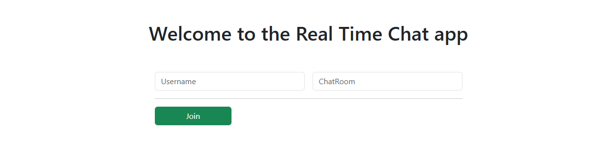
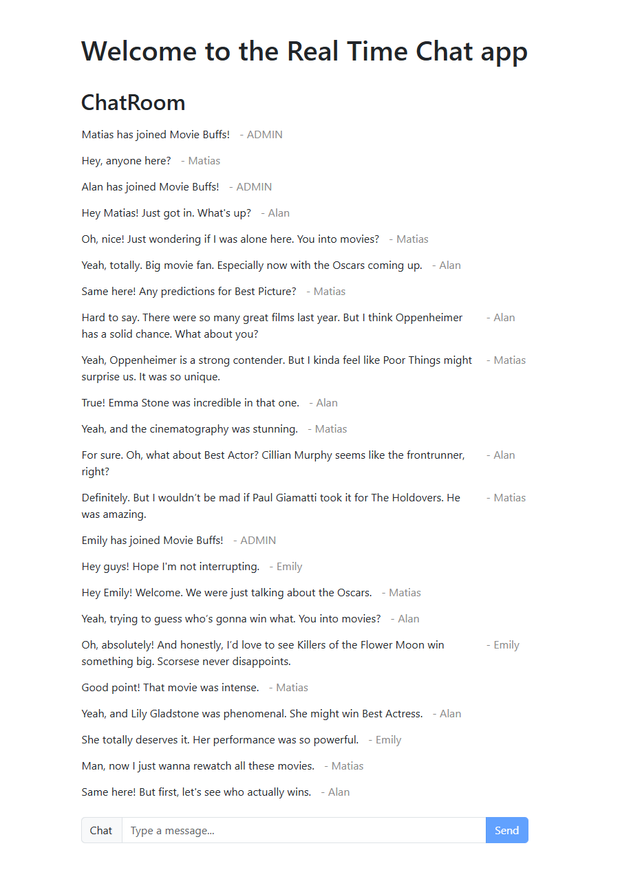

# About the project
This is a simple real-time chat application built with ASP.NET Web API, SignalR and React. The goal of this project was to explore and learn more about SignalR and real-time communication. To keep things simple, all chat messages are stored in a dictionary, avoiding the need for a database. SignalR, which internally supports WebSockets when available, ensures instant message delivery between clients, making the chat experience seamless and responsive. Since the project doesn't rely on a database, it's easy to set up and run, making it ideal for quick prototyping or experimentation.

# Tech Stack
The project uses ASP.NET Web API for the backend, which handles HTTP requests and manages the real-time communication logic. It provides the necessary endpoints for clients to connect and exchange messages. SignalR is used to enable real-time communication between clients and the server. SignalR ensures instant message delivery by broadcasting messages to all connected users. It supports WebSockets when available, providing low-latency updates. The frontend is built with React, which dynamically updates the user interface as new messages arrive via SignalR. The UI allows users to send and receive messages in real time. Bootstrap is used for styling the chat interface, ensuring a responsive and visually appealing layout with minimal custom CSS.
<table align="center">
    <tr>
        <th></th>
        <th>
            Frontend
        </th>
        <th>
            Backend
        </th>
    </tr>
    <tr>
        <th>
            Languages
        </th>
        <td>
            
            
        </td>
        <td>
            
        </td>
    </tr>
    <tr>
        <th>
            Frameworks
        </th>
        <td>
          
          
        </td>
        <td>
            
        </td>
    </tr>
    <tr>
        <th>
            IDE / Editor
        </th>
        <td>
          
        </td>
        <td>
            
        </td>
    </tr>
</table>

# Requirements
1. Install [`.NET SDK`](https://dotnet.microsoft.com/en-us/download) (includes .NET Runtime).
2. Install [`Node.js`](https://nodejs.org/en) and ensure it includes the `npm` package manager.

# How to run locally (command line)
1. Run a `git clone` of the repository and open the `root folder`:
```
git clone https://github.com/LucasOkokama/real-time-chat-signalr.git
cd real-time-chat-signalr
```
2. Open the `FormulaOne.ChatService` folder and Install the `dependencies`:
```
cd FormulaOne.ChatService
dotnet restore
```
3. `Run` the backend:
```
dotnet run
```
4. Create another `CDM window` (root folder), open the `FormulaOne.ChatApp` folder and Install the `dependencies`:
```
cd FormulaOne.ChatApp
npm install
```
5. `Run` the frontend:
```
npm run dev
```
6. Access `localhost` to open the website:
```
http://localhost:5173
```

# References
The development of this project was guided by the video [`.NET 8 .🚀🔥: Building a Real-Time Chat App with .NET SignalR and React A Step by Step Tutorial`](https://www.youtube.com/watch?v=pvi_ZS_PrSc), produced by [`Mohamad Lawand`](https://github.com/mohamadlawand087)

# Project Screenshots
### Homepage


### Chatroom


# License
```
MIT License

Copyright (c) 2025 Lucas Kazuhiro Okokama

Permission is hereby granted, free of charge, to any person obtaining a copy
of this software and associated documentation files (the "Software"), to deal
in the Software without restriction, including without limitation the rights
to use, copy, modify, merge, publish, distribute, sublicense, and/or sell
copies of the Software, and to permit persons to whom the Software is
furnished to do so, subject to the following conditions:

The above copyright notice and this permission notice shall be included in all
copies or substantial portions of the Software.

THE SOFTWARE IS PROVIDED "AS IS", WITHOUT WARRANTY OF ANY KIND, EXPRESS OR
IMPLIED, INCLUDING BUT NOT LIMITED TO THE WARRANTIES OF MERCHANTABILITY,
FITNESS FOR A PARTICULAR PURPOSE AND NONINFRINGEMENT. IN NO EVENT SHALL THE
AUTHORS OR COPYRIGHT HOLDERS BE LIABLE FOR ANY CLAIM, DAMAGES OR OTHER
LIABILITY, WHETHER IN AN ACTION OF CONTRACT, TORT OR OTHERWISE, ARISING FROM,
OUT OF OR IN CONNECTION WITH THE SOFTWARE OR THE USE OR OTHER DEALINGS IN THE
SOFTWARE.
```
